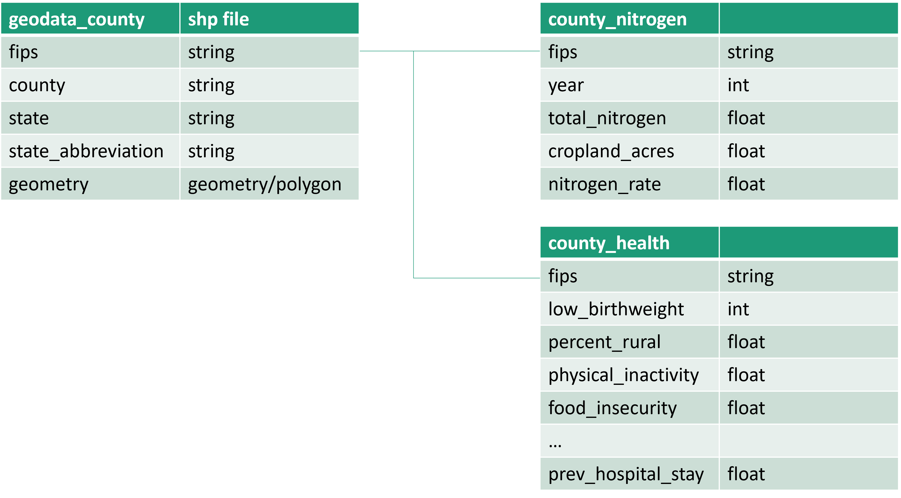

## Project Background
BioSand Health Institute is a mock public health non-profit located in and serving the U.S. Environmental Protection Agency (EPA) Region 7 ( Mid West- Kansas, Iowa, Missouri, and Nebraska).

The organization compiles regional health and environmental data, including behaviors, socioeconomic factors, and physical environment metrics (air quality, nitrogen levels in fertilizer). This project analyzes and synthesizes this data to 1) assess the health risks of nitrogen pollution on low birthweight and 2) develop a health risk assessment, guiding more effective program resource distribution and maximizing impact.

**Problem**: There is limited understanding of how nitrogen levels relate to key health outcomes such as low birthweight in the Midwest, creating challenges for planning and targeting intervention efforts.

**Goal**: To provide a nitrogen health risk assessment of county-level risk by analyzing spatial patterns between nitrogen concentrations and low birthweight outcomes

An interactive PowerBI dashboard can be viewed [here](https://app.powerbi.com/view?r=eyJrIjoiZDNkZmRiYmQtNDViOC00NDU2LTk1ZDAtMzc1N2FkZGFiNDBiIiwidCI6IjA2MTM4ZTY4LWJmOGItNDUwYS1iMmJmLWYyNTljMjczYWYxNiJ9).  

### Data Structure and Initial Checks

BioSand's finailized project database structure as seen below consists of three tables: geodata_county, county_nitrogen, and county_health. All can be joined using each county’s  Federal Information Processing Standard (FIPS) code. 

`county_health` includes a total of 85 county-level health outcomes and indicators in the following areas: health behaviors (tobacco use, diet and exercise, alcohol and drug use), clinical care (access to care, quality of care), social and economic factors (education, employment, income), physical environment (air quality) and demographics (age, race/ethnicity). 

Python code can be found at the following links:  
+ Data [sources, cleaning and preparation](source_and_carpentry.py) for analysis.   
+ Nitrogen: [Exploratory data analysis](ExploratoryDataAnalysis_Nitrogen.py) and [Geospatial autocorrelation](SpatialAutocorrelation_Nitrogen.py)(Hot spot analysis)  
+ Low Birthweight: [Exploratory data analysis](ExploratoryDataAnalysis_LB.py) and [Geospatial autocorrelation](SpatialAutocorrelation_LB.py) (Hot spot analysis)   
+ [Multiscale Geographical Weighted Regression](GWR_MGWR_LowBirthweight.py) (MGWR)

## Executive Summary 

### Overview of Findings 

The relationship between nitrogen levels and low birthweight (<2,500 g) rates varied across the Midwestern region (Kansas, Iowa, Missouri, and Nebraska) — with higher nitrogen rates in  northern Missouri, central Nebraska, and Kansas corresponding to increased rates of low birthweight. Recommendations include targeting efforts to reduce the impact of nitrogen runoff on birth outcomes in these  affected focus areas. 

Below is the summary section from the Power BI dashboard. More examples are included through the report. The entire interactive dashboard can be viewed [here](https://app.powerbi.com/view?r=eyJrIjoiZDNkZmRiYmQtNDViOC00NDU2LTk1ZDAtMzc1N2FkZGFiNDBiIiwidCI6IjA2MTM4ZTY4LWJmOGItNDUwYS1iMmJmLWYyNTljMjczYWYxNiJ9). 

## Insights Deep-Dive

Nitrogen Landscape 

[ Studies that were published about nitrogen levels if you can find those records. ]
